# Procedural Planet Generation

(Originally published at <https://experilous.com/1/blog/post/procedural-planet-generation> on 2014/09/30.)

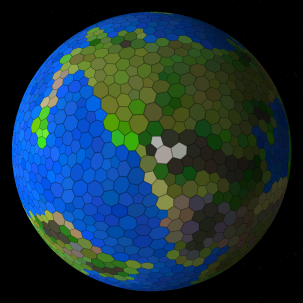

For the past two and a half weeks, I’ve been working on a procedural planet generator.  This weekend I finally polished it up enough to talk myself into putting it online.  You can check it out [here](planet-generator.html "Planet Generator (Version 2)").  (It’s heavy on the JavaScript, so I recommend Chrome.  Firefox and IE are slower, but manage.  I haven’t tried any other browser yet.  Also, I’ve never yet delved into supporting touch controls, so it’s pretty much keyboard only.  Sorry mobile users.)

A lot of different steps go into generating the planet, utilizing a variety of algorithms and techniques.  They’re not perfect, and some of them are in fact quite finicky, requiring a lot of cautious tweaking of parameters and behaviors.  Some of them are bad enough to make me cringe.  But they work.  At least well enough to make some pretty pictures, and some planets with enough variety that they might be a half decent foundation for some strategy mechanics.  So in case anyone might be able to glean some useful ideas from my work, allow me to delve into some of the details (and include tons of colorful pictures along the way).

This is a long one, so here is a table of contents:

1.  [Cylinders and Spheres](#cylindersAndSpheres)
2.  [Tessellating a Sphere](#tessellatingASphere)
3.  [Irregularity Everywhere](#irregularityEverywhere)
4.  [Subdivided Icosahedrons](#subdividedIcosahedrons)
5.  [Elevation](#elevation)
6.  [Weather](#weather)
7.  [Biomes](#biomes)
8.  [Code, Libraries, and Other Mundane Aspects](#codeLibraries)
9.  [Wrap-up](#wrapup)

## Cylinders and Spheres

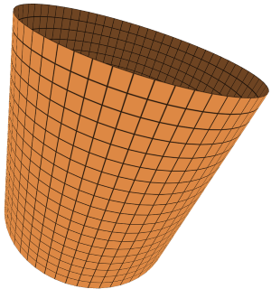

Before I get into the technicals, first a bit about my original motivation.  One of the vague game ideas that I’ve been toying with for a few years is basically a non-competitive sandbox adaptation of a Civilization-style game.  So naturally it can take place on the scale of an entire planet.  It has always annoyed me, though, that standard planetary maps have almost always been cylindrical.  Whether it is a square, isometric, or hexagonal grid, when the map wraps around on the left and right but not the top and bottom, that is essentially a cylindrical world.

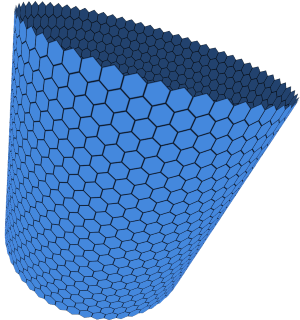

It’s an effective and simple technique that captures some of the essence of a planetary map.  But certain elements are simply left unavailable.  Missiles trajectories and shipping lanes across the poles, for example.  It also results in the mostly ignorable but still slightly odd feature that circumnavigating the globe while staying very far north or south takes just as long as circumnavigating the globe at the equator.  This is of course not at all true on an approximately spherical world.

So out of this nagging annoyance, and maybe just for the sake of taking up the challenge it posed, I spent time thinking about ways to address this, to get a more spherical map. But a _tiled_ map, keep in mind. Just as with Civilization and so many other strategy games, I wanted to keep the tile system. Plenty of other games have been experimenting with spherical maps that aren’t tile based, and that’s excellent. But I personally know of none that have tried to do the spherical thing while maintaining a strong tile system for movement and other strategic elements. I _really_ like the feel that tile-based games produce, and want to bring that feeling to a spheroidal world.

## Tessellating a Sphere

I can easily imagine why I haven’t yet encountered a game that attempts this. Trying to stick tiles on a sphere is obnoxious. The maximum number of perfectly uniform tiles is twenty, in the form of triangles that compose an [icosahedron](http://en.wikipedia.org/wiki/Icosahedron "Wikipedia:  Icosahedron"). Anything above twenty, and stuff absolutely has to get non-uniform, in a few different ways. You might have tiles with different numbers of neighbors, such as the [truncated icosahedron](http://en.wikipedia.org/wiki/Truncated_icosahedron "Wikipedia:  Truncated icosahedron"), a mix of hexagons and pentagons. Or you could have tiles that are all the same type of polygon, but are distorted to various degrees, such as by subdividing cube and then projecting all the points onto a sphere. You’ll have a lot of quadrilaterals, but very few of them will look square. Taking the subdivide and project approach also leads to a few isolated but predictable spots where fewer tiles than normal all touch the same point. With the subdivided cube, this happens at each of the original eight corners of the cube, where only three squares meet at a point instead of four. Or with a subdivided icosahedron, where only five triangles meet instead of six (the next picture further down includes an example of this in the top right polyhedron).

Now it’s true that a game could go ahead and utilize a subdivision technique, and just accept the intermittent irregularities as an acceptable oddity. Any effects they have on strategy, such as the rare but predictably located pentagons being stronger defensive tiles since they can only be attacked from five simultaneous directions rather than six, could just be acknowledged as an aspect of the game, corresponding to nothing in reality. But I was too stubborn to accept this. Luckily, I happened to think up a creative solution to this conundrum last year, and it’s been bouncing around in my brain ever since.

## Irregularity Everywhere

The problem with the intermittent irregularities has to do with how predictable they are. If there are a lot of them, they follow a very clear and inorganic pattern. If there are very few, then their isolated nature makes them stand out like a sore thumb. But what if they weren’t predictable? What if they weren’t isolated? What if the irregularities were potentially all over the place, and with little rhyme or reason to their arrangement? Sometimes right next to each other, maybe even in clusters of three or four? Maybe they wouldn’t seem so out of place any longer. Maybe they’d fit into the game mechanics much more naturally, rather than being a crude deviation.

So how does one go about tiling a sphere in an organic way? Inspired by Amit Patel’s excellent page on [polygonal map generation](http://www-cs-students.stanford.edu/~amitp/game-programming/polygon-map-generation/ "Red Blob Games:  Polygonal Map Generation for Games"), my first attempt was to generate a collection of randomly generated points, uniformly distributed across the surface of a sphere, and then generate the [Voronoi diagram](http://en.wikipedia.org/wiki/Voronoi_diagram "Wikipedia:  Voronoi diagram") based on these points. Unfortunately, I got a bit hung up because most resources on Voronoi diagrams focus on two dimensional diagrams. Adapting it to three dimensions seemed trickier, and it’s harder to find accessible descriptions on how to do this. Complicating things further is the fact that I’m still only wanting a two dimensional diagram, but instead of being in Euclidean space, it is in [spherical space](http://en.wikipedia.org/wiki/Elliptic_geometry "Wikipedia:  Elliptic geometry"). But I did get inspired by a particular two dimensional method I ran across. The core idea is that you take a 2D collection of points and project them onto a 3D parabola (simply set z = x2 + y2). Then you find the [convex hull](http://en.wikipedia.org/wiki/Convex_hull "Wikipedia:  Convex hull") of the 3D points, which, given the nature of the parabolic projection, is guaranteed to include all the points. This convex hull will conveniently be equivalent to the [Delaunay triangulation](http://en.wikipedia.org/wiki/Delaunay_triangulation "Wikipedia:  Delaunay triangulation") of the points. And the Delaunay triangulation just so happens to be easily convertible to a corresponding Voronoi diagram.

Just as with the parabola, I knew that all my points would be included within the convex hull, so I figured that if I could compute the convex hull, I’d be able to quite simply get the Voronoi diagram. But figuring out how to efficiently compute the convex hull was more difficult than I expected. Again, reference material tended to focus on two dimensions. I did manage to come up with a recursive divide-and-conquer algorithm that seemed to work, but it was _ugly_. Every step threatened to create a concave pair of triangles, so the algorithm had to constantly guard against that, fixing up the triangle mesh every time it generated concavity.

Once that seemed to be working, I used [Lloyd’s algorithm](http://en.wikipedia.org/wiki/Lloyd%27s_algorithm "Wikipedia:  Lloyd's algorithm") to relax the mesh, as recommended on Amit’s page above, so that my tiles would be more regularly shaped, with fewer really squashed or tiny tiles. But this is where I started to run into troubles. No matter what I did, I couldn’t seem to keep my convex hull algorithm in order; it kept creating strange overlapping or backward facing triangles here and there, sometimes everywhere. I also could not reliably avoid incredibly short edges between tiles, which made it often look like four tiles touched at a single point, even though technically only two tiles did, and the other two were just ever so slightly separated from each other by the two touching tiles. In retrospect, I think I have some ideas of how to avoid those problems while sticking with the same underlying technique, but at the time I ditched it.

## Subdivided Icosahedrons

Instead, I decided I would start with a highly ordered mesh, and then disrupt it bit by bit until it was significantly irregular. A subdivided icosahedron was a natural fit, since it did a decent job of minimizing large scale distortions in the shape and size of tiles. (The distortions I wanted are smaller in scale; I still want large scale uniformity.) Initially, I just subdivided each triangle directly, with all of the subdivided points lying on the same plane, and afterward projected them onto a sphere, but I knew that this generated some of that unwanted large scale distortion. I later learned that using spherical linear interpolation, or the [“slerp” function](http://en.wikipedia.org/wiki/Slerp "Wikipedia:  Slerp"), avoids this, so huzzah!

I also didn’t want triangular tiles in the end. I rather like how tiles on a hexagonal map are guaranteed to never touch at just a single point; touching tiles _always_ share an entire edge. Fortunately, it’s incredibly easy to take a triangle mesh and turn it into a map of tiles with precisely this property: Simply treat every point of the triangle mesh as a tile, and every triangle as a corner of a tile. This forms what is known as the [dual polyhedron](http://en.wikipedia.org/wiki/Dual_polyhedron "Wikipedia:  Dual polyhedron"). (It’s also the basis for converting a Delaunay triangulation into a Voronoi diagram.) Here’s a diagram with a regular icosahedron, a second one that has had each edge subdivided into two segments, and a third with each edge subdivided into eight. It then shows how each one can be converted into it’s dual polyhedron.

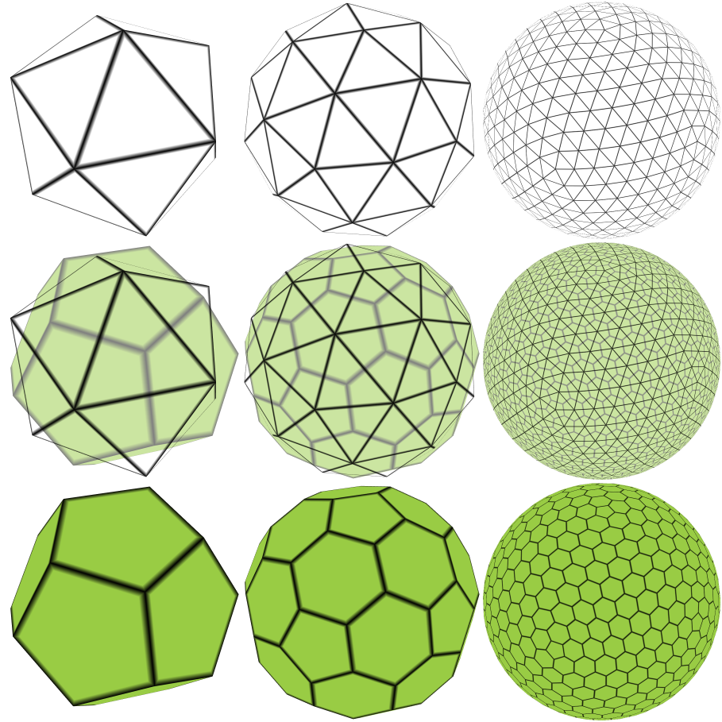

Subdivided icosahedrons, and the corresponding dual polyhedra.

Note that the regular icosahedron’s dual is entirely pentagons (twelve of them to be exact; it’s a [dodecahedron](http://en.wikipedia.org/wiki/Dodecahedron "Wikipedia:  Dodecahedron")), but the higher subdivisions are mostly hexagons. In fact, no matter how detailed the subdivision gets, there will always be twelve pentagons embedded at fixed locations around the mesh, corresponding exactly to the vertices of the original icosahedron. Time to start adding that irregularity.

Conveniently, one of the functions I wrote while working on convex hulls was exactly what I needed to produce this irregularity. The idea is simple: Find two triangles that share an edge. Remove that edge, and replace it with an edge between the two points that are at opposite ends of the two triangles. In a sense, the edge has now been rotated, and the topology of the mesh has been perturbed. But this is likely to create some wildly obtuse triangles, which in turn make tiles look really ugly. So we relax the mesh somewhat, trying to pull those triangles back into a vaguely equilateral shape as much as we can, without severely disturbing nearby triangles. Here’s a diagram of the process in action, along with how it affects the tiles formed by the dual polyhedron:

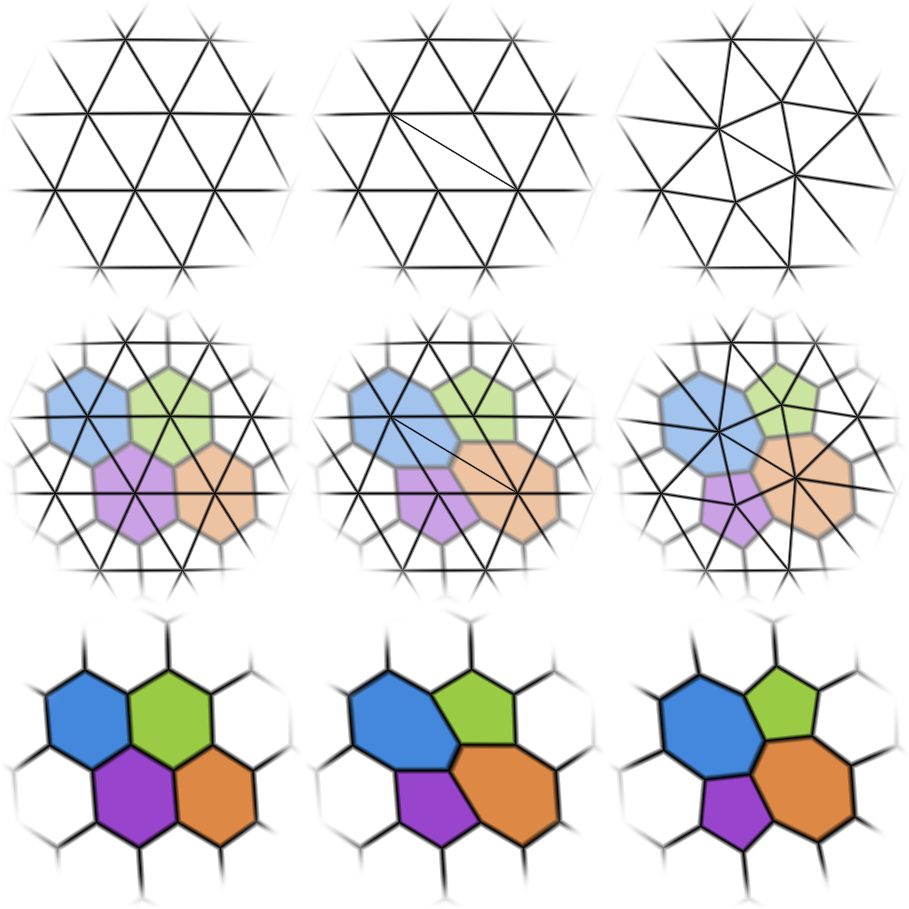

Rotating an edge to perturb the topology of a mesh.

Notice how the tiles were originally all hexagons, but after the transformation, two of the hexagons turned into pentagons, and two others turned into heptagons. Using this technique, pentagons and heptagons will always retain this balance (though there will always be precisely twelve more pentagons than heptagons, thanks to the initial twelve). But if we do it on enough edges randomly, the one-to-one pairing will not be obvious at all, with pentagons and heptagons sort of migrating and popping up all over the place. This system also enables me to increase or decrease the regularity simply by modifying how many edges I randomly rotate. Below are three examples of a distorted mesh. The first has very few edge rotations, the second a moderate amount, though you can still pick out the regular hexagonal pattern, and the third has a lot of edge rotations.

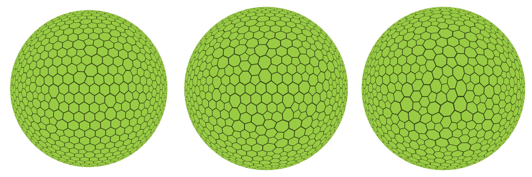

Slightly, moderately, and heavily distorted meshes, all beginning with a subdivided icosahedron.

In my particular use of this transformation, I added some checks before approving a randomly selected edge for rotation. First, if the rotation would generate a tile with more than seven or fewer than five neighbors, I rejected the edge and randomly selected another. Second, if the original edge length and rotated edge length were too different, I rejected it on the grounds that I’d be making an already badly distorted segment of the mesh even worse. Third, I had to go so far as to ensure that neither of the original triangles had an obtuse angle along the shared edge. This added some hefty computations to the check, but helped avoid some distortions to the mesh that I found hard to recover from. The third mesh above is pretty much maximally distorted within the bounds of these constraints. Rotating even more edges would not increase the irregularity notably.

As for relaxing the mesh, I didn’t actually do that step after every single edge rotation. Instead, I did a bunch of edge rotations, and then did a single relaxation pass over the whole mesh. I proceeded with more rotations, followed by another relaxation pass. I did this six times (arbitrary number chosen empirically), after which I ran repeated relaxation passes until the mesh passed some threshold of being sufficiently relaxed. Or at least until it didn’t seem to be getting any more relaxed and was simply spinning in circles.

I also ended up using a different method than Lloyd’s algorithm. That algorithm requires the calculation of circumcenters for every triangle in a Delaunay triangulation in order to generate a Voronoi diagram, followed by calculating the centroids for each cell in the Voronoi diagram to create a new Delaunay triangulation. Not only is that a lot of computation, but because of my distortions to the mesh, circumcenters had a tendency to get pretty wild, especially since the circumcenter of an obtuse triangle isn’t even within the bounds of the triangle itself. The result was often the degenerate, overlapping, or backward facing triangles that I had been dealing with earlier, and I was starting to realize that it was the circumcenters that were causing most of this trouble.

Instead, I focused entirely on the centroids of the triangles, which were guaranteed to always be within the bounds of the triangles. For each triangle, I calculated the distance from each corner to the centroid. I compared these distances to a precomputed ideal distance for an equilateral triangle of the appropriate size, given the surface area of the planet and the number of triangles I had. I then pushed or pulled the corners to bring them closer in line to this ideal distance. (I had to underestimate this size a little bit, though, or else it put too much pressure on the mesh, causing some triangles to flip completely around, because there wasn’t enough positive space for them.) There might be better mathematical explanations for why this works, or a different technique that would accomplish the same concept but more efficiently, but this worked well enough so I stuck with it.

Once I had the triangle mesh fully distorted and relaxed, I generated the dual polyhedron by interpreting triangles as tile corners, and vertices as tile faces. (Edges remain where they are essentially, though visually they become more or less orthogonal to their original arrangement, as you can observe in some of the images above.) As mentioned, the general approach for doing this with a Voronoi diagram is to use the circumcenters of triangles, but again I found that centroids worked more reliably. The did produce some visual stretchiness that circumcenters were better at avoiding, but I realized that these stretched tiles weren’t necessarily a bad thing; subjectively, the centroid-based tiles perhaps even look better. And since they also avoided the wild nastiness of circumcenters which caused the occasional tile or cluster of tiles to be egregiously broken, I was elated and decided to get on with the rest of the planet generation.

## Elevation

[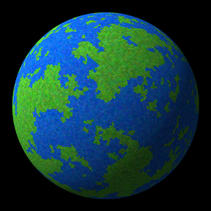](https://twitter.com/AndyGainey/status/513424516060811265/ "Tweet from 2014/09/20")

From a tweet on 2014/09/20

At this point, to create a pretty screenshot for Twitter’s [#ScreenshotSaturday](https://twitter.com/search?q=%23screenshotsaturday "Twitter:  #ScreenshotSaturdy"), I used a hasty probabilistic flood fill algorithm to create blobs of land and water, coloring one green and one blue, with some random variation to add character. It worked well enough for the ten minutes it took to code it up, but it was far from sufficient for creating interesting geographic formations. I needed real elevations at a minimum.

[Perlin noise](http://en.wikipedia.org/wiki/Perlin_noise "Wikipedia:  Perlin noise") is a common algorithm used for this type of task, and I have dabbled with it in the past. But for some reason, I was hesitant to go down that road. Although the type of features it generates are definitely complex and interesting, they still tend to have a specific visual flavor that wasn’t quite what I was looking for. Perlin noise tends to be just a little bit too uniformly organic, but I want distinct geography with elements that really stand out. Mountain ranges and island chains, for example, that look like they really belong where they are, rather than just being the accidental byproduct of an oblivious height generating algorithm.

So tectonic plates naturally came to mind, and I was audacious enough to take them on. To be honest, at the time this felt like it might be one of the quicker routes to getting interesting geography, in contrast to a Perlin noise type of approach. That ultimately wasn’t entirely accurate, but the plates did happen to work out impressively well despite me not entirely knowing what I was doing.

First step was to actually define the plates. To do this, I randomly picked a fixed number of starting tiles, and then simply performed a random flood fill on all of them simultaneously. Once every tile on the planet belonged to a tectonic plate, I then calculated a few random parameters for each plate that would represent its movement and other attributes. The first was an axis passing through the center of the planet, around which the plate would rotate, along with a small angle to represent the rate of rotation. This generally represented a drifting movement, though it could produce a spinning type of movement if the axis passed through the plate itself. The second parameter was simply another small angle representing the rate of spin about the arbitrarily chosen center point of the plate. These two parameters together gave each tectonic plate a random amount of drift and spin, which would naturally cause boundaries between plates to have conflicting relative motion. In addition to movement, I randomly assigned the plate to be either oceanic or not, and then randomly picked a desired elevation for the plate. This elevation fell within a particular positive range for land plates, and within a negative range for oceanic plates. (Sure, floating oceans with mile high waterfalls would be awesome, but let’s keep the algorithms grounded for now.)

[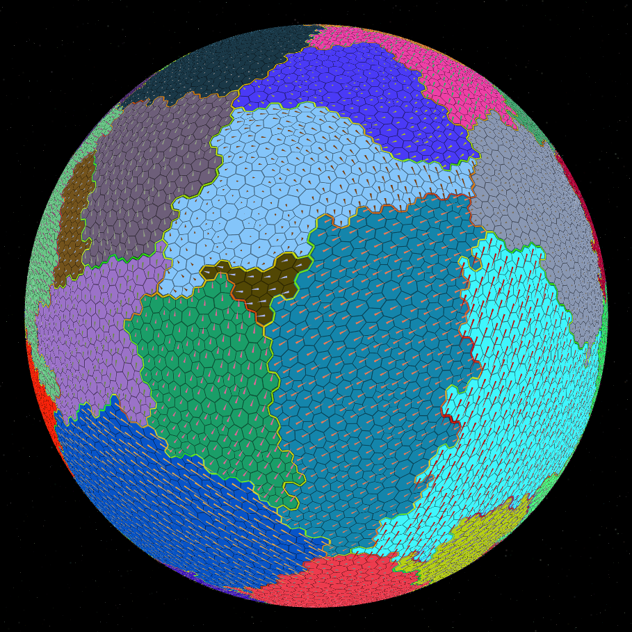](https://experilous.com/1/blog/2014-09-29-tectonic-plates.png)

Tectonic plates, their movements, and the stresses along their boundaries. Click for a larger version.

The next step was to take the motion of plates and calculate the type and degree of stress at each point along the boundaries between the plates. For each point, I calculated the movement of each plate at that particular position. Subtracting the two gave me the relative movement. I then determined the component of that movement that exactly perpendicular to the plate boundary at that location. This corresponded to the amount of relative movement that was directly pushing the plates into each other or pulling them directly away. This I classified as pressure, and it could be either positive (collision) or negative (separation). I also determined the relative movement that was parallel to the boundary and stored this as shear. (Only the magnitude of this movement was relevant, so shear was strictly non-negative.)

With the type and degree of stress determined along the plate boundaries, I then used that information to assign elevations to each boundary point. For points where positive pressure was most prominent, I first checked to see if they were both ocean or land plates. If they were the same, then I treated them as directly colliding, took the maximum desired elevation of the two plates, and then added some additional elevation to create a mountain range. But if one was ocean and the other land, I presumed that the oceanic plate was subducting underneath the land plate, and adjusted my elevation calculations. For shearing and negative pressure interactions, I simply used the maximum desired elevation and created a weaker raised effect regardless of the type of plates involved. For boundaries where stress of all kinds were sufficiently low, I simply averaged the desired elevations of both plates and used that as the boundary elevation.

[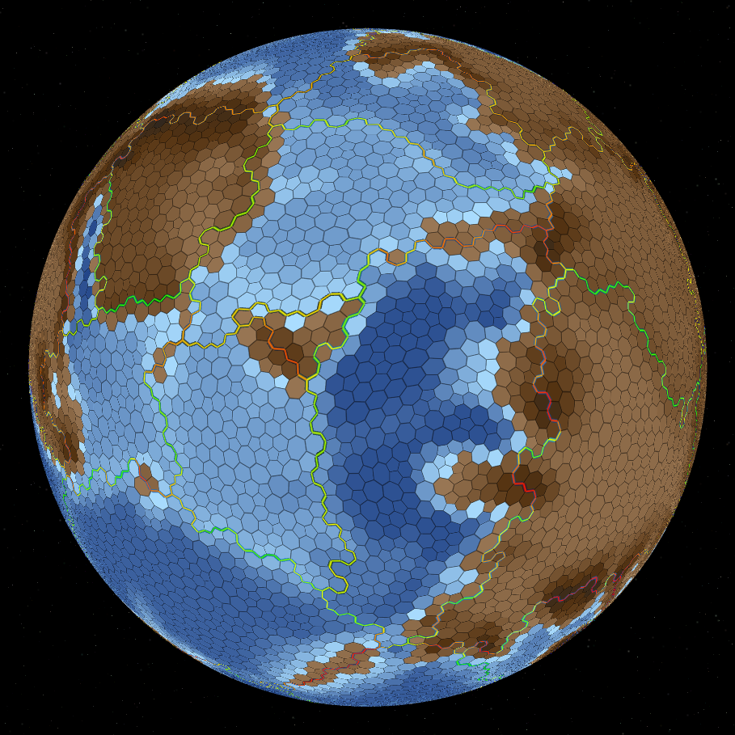](https://experilous.com/1/blog/2014-09-29-elevation.png)

Elevation calculated from tectonic plate interactions. Click for a larger version.

With the tectonic interactions figured out and boundary elevations calculated, it was time to determine elevations for all the interior points of each plate. I basically used a priority queue to process points one by one, in order of how close to the boundary they were. At each point, I used the distance to the plate’s boundary, the distance to the plate’s center, and the elevation and tectonic activity at the nearest boundary to determine the elevation of that point. Most tectonic activity generated a pretty simple curve of elevation that was interpolated from the boundary to the center. Land plates with ocean plates subducting underneath them had a somewhat different curve, starting off with a lower elevation, quickly rising into a mountain range and then falling again to the plate’s desired elevation. This was inspired by Wikipedia’s pictures for [convergent boundaries](http://en.wikipedia.org/wiki/Convergent_boundary "Wikipedia:  Convergent boundary").

Ultimately, I think I made a enough assumptions and had enough misunderstandings to make geologists facepalm in profuse disappointment. But really, who cares? I have pretty looking continents! Well, the beginnings of them anyway.

[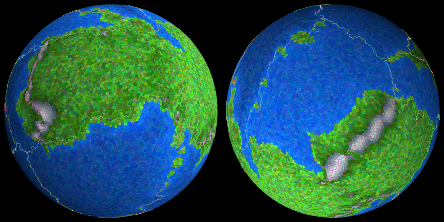](https://twitter.com/AndyGainey/status/514202824717004800/ "Tweet from 2014/09/22")

From a tweet on 2014/09/22

## Weather

Coloration of grass, mountains, and ocean based on elevation was enough to again give my a nice picture for Twitter. But was still lacking in terms of deserts, forests, jungles, and other such varied biomes. To conquer this challenge, I decided I would need some air currents to spread heat and moisture around, and to understand how moisture would affected by elevation along its travels as it turned to precipitation. Fortunately, I didn’t feel compelled to tackle a realistic simulation of air currents. Instead, I simply picked some points around the globe and treated those as the center points of around which air would travel, in a boringly circular fashion. Except not entirely boring, because where two circular patterns overlapped, I’d calculate a weighted average to determine the final direction and intensity of airflow at that point. With a careful selection of points on the sphere, along with some random perturbation of their location, strength, and size of influence, I ended up with air current patterns that felt like a nice mix between orderly and chaotic.

[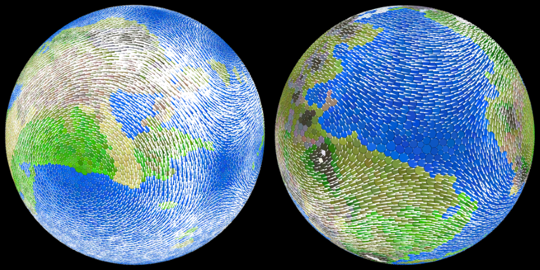](https://twitter.com/AndyGainey/status/515181903477866497/ "Tweet from 2014/09/25")

From a tweet on 2014/09/25

Adding heat and moisture to the mix was more challenging than I had anticipated. The idea was fairly simple: Do a single pass to generate an amount of heat and moisture at each point on the planet, and then do multiple passes to move the heat and moisture around according to the air currents, until all heat and moisture had been consumed. Turns out that’s a tricky process to get right, especially when one is playing fast and loose with units of energy, distance, area, velocity, and mass. It’s all just unitless floating point numbers to the computer. Being lazy, I did what I had to, squaring and dividing numbers as necessary to make thing more or less work out. But it probably just needs to be rewritten from scratch eventually. Nonetheless, as with much of the work above, it ended up performing its objective well enough for the moment.

[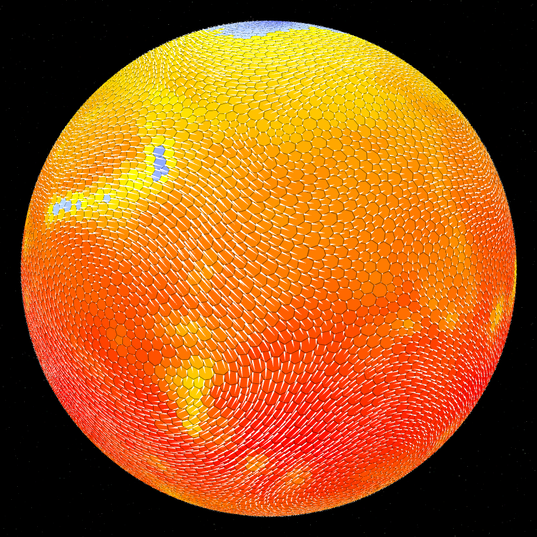](https://experilous.com/1/blog/2014-09-29-temperature.png)

Temperature determined by air currents, elevation, and latitude. Click for a larger version.

In my actual implementation, I computed the heat first. Every point generated the same amount of initial heat per area (which I now realize is silly; at the very least, polar regions would absorb less heat from the star). I then spread it around pretty simplistically, each point absorbing as much heat as it could when the available heat passed through, modulated by the air velocity (lower speed allowed more time for each point to absorb more heat). Finally, I used the absorbed heat, elevation, and latitude of each point to determine a final temperature, forced to fit within my own temperature scale from -2/3 to +1, with 0 as the freezing point.

[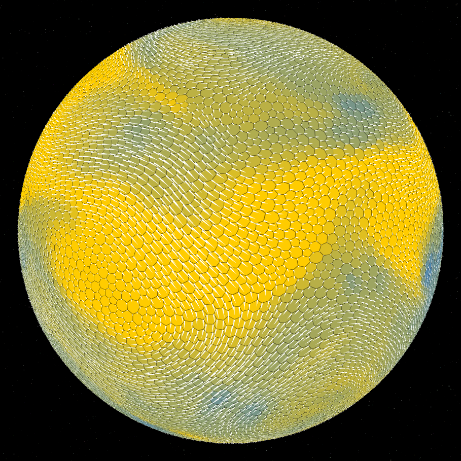](https://experilous.com/1/blog/2014-09-29-moisture.png)

Moisture, determined by air currents, bodies of water, temperature, and elevation. Click for a larger version.

Once that was determined, it was used to determine how much moisture would be available at each tile to spread elsewhere. Land tiles produced no moisture; they only consumed it. Ocean tiles produced moisture according to their area and temperature. Hotter areas evaporated more moisture into the air than cooler areas. (As with the geology, I’m sure I’ve annoyed some meteorologists just now also. They can commiserate together.) The moisture was then spread in a fashion similar to heat, but with some extra considerations for elevation and temperature (higher elevation and colder temperature would cause more precipitation). The result was that air coming inland from the ocean would carry lots of moisture with it. If the air blewws over a large stretch of plains, a lot of moisture was spread far inland, with each point getting a fair amount of precipitation before the air became too dry. But if the air passed over a mountain range, it tended to dump a lot of its rain quickly, and the land on the far side of the mountain range was drier as a result. This is known as a [rain shadow](http://en.wikipedia.org/wiki/Rain_shadow "Wikipedia:  Rain shadow").

## Biomes

Now that I had elevation, temperature, and precipitation, I felt I had enough variables to generate some interesting biomes. It’s a function that could be tweaked forever, but I put together a few rules that determined which of a handful of biomes a tile was assigned based on those three parameters. Low elevation hot regions with little precipitation became deserts, while those with lots of precipitation became rainforests. Low elevation temperate regions with moderate rainfall became grassland. Cold regions with little moisture became tundra. High elevations became rocky mountains or snowy mountains depending on temperature and precipitation. And so on. This gave me the diversity necessary to produce the following planets, and is more or less representative of the [version](planet-generator.html "Planet Generator (Version 2)") that’s publicly accessible on this website.

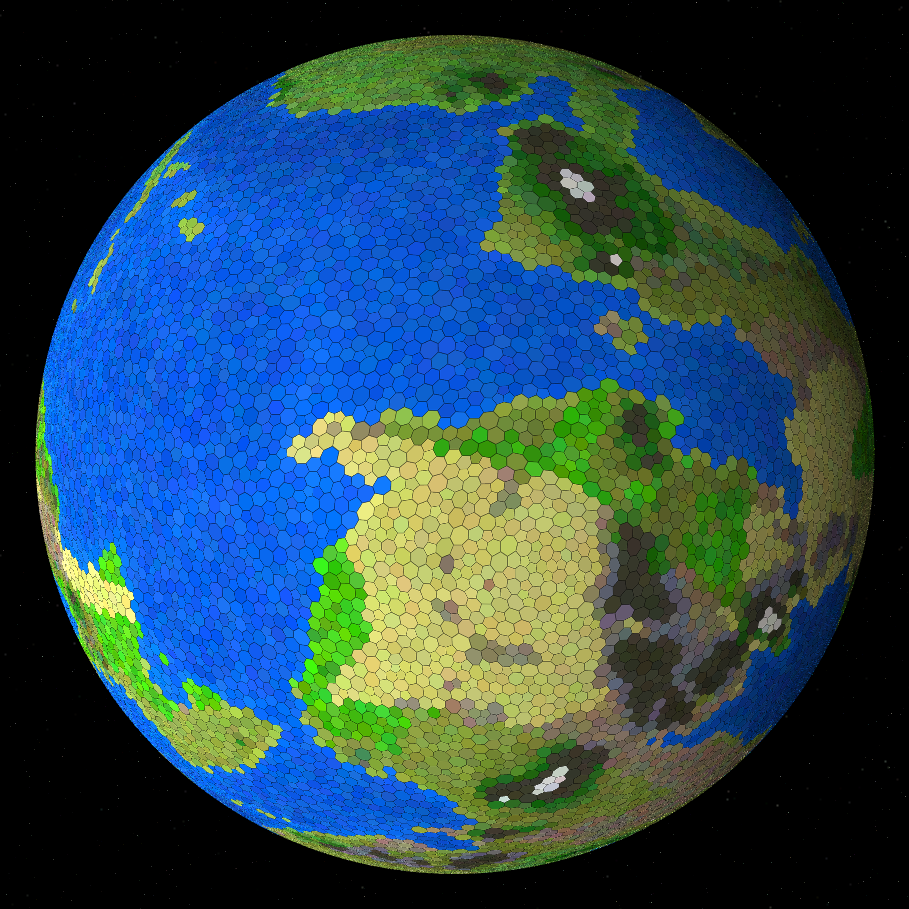

High detail planet.

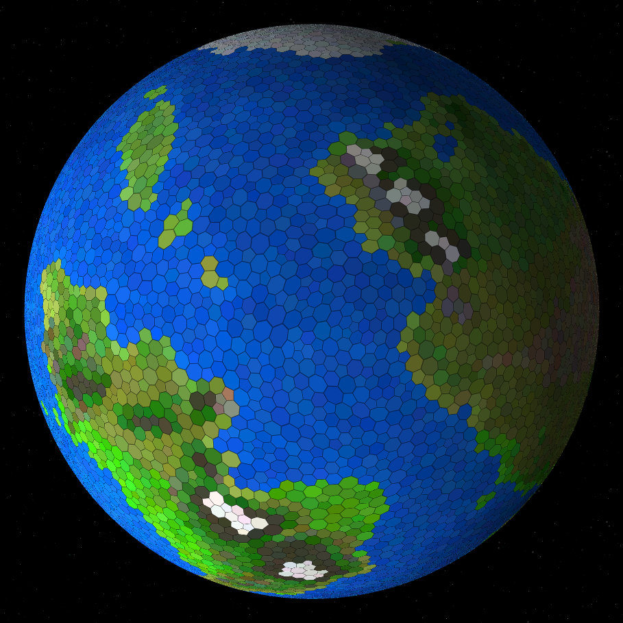

Medium detail planet.

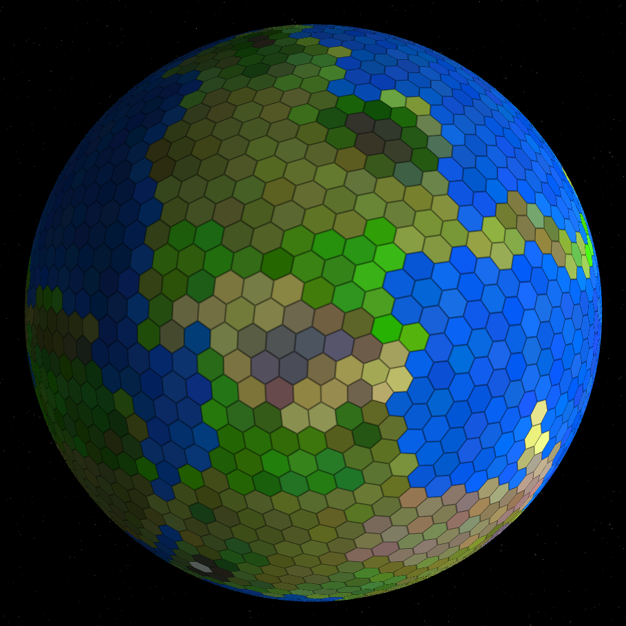

Low detail planet, with no distortion of the original subdivided icosadron topology. Look in disgust at that rogue pentagon, just to the bottom right of center.

## Code, Libraries, and Other Mundane Aspects

The code is 100% JavaScript, and can be obtained [here](planet-generator.js "Planet Generator Source Code (JavaScript)"). It utilizes [three.js](http://threejs.org/ "three.js website") as a wrapper around WebGL. It’s fairly easy to use, and gave me simple access to the vertex and triangle buffers, which is great for procedurally generated geometry. It’s documentation is incomplete and at times outdated, but a quick peek at the source usually cleared things up. This is my first project delving into the realm of WebGL, and I have been pleased with the experience.

I continue to use [jQuery](http://jquery.com/ "jQuery website") for my HTML manipulations. This is the first time that I’ve used HTML as an overlay on top of a canvas, and it makes me happy how such a technique makes it easy to transfer my HTML skills over to the process of making a UI for a game-like environment. And jQuery extends that happiness even further.

I continue to wish Lua had become the language of the web instead of JavaScript. For one, the inability to use an object reference as a key in an object used as a dictionary is frustrating. But I’ve adapted my designs to compensate for this, so I didn’t feel severely affected by that on this project (though I did notice it). What really got me this time was JavaScript’s utterly single-threaded execution model. Initially, all the processes described above executed within the context of a single function `generatePlanet()`. Once things got complicated enough, this would cause the browser to kill the page because it presumed the page was permanently hung. It also meant that I had no hope of implementing a progress bar, let alone a way to cancel an in-progress generation of a planet.

Of course, Lua doesn’t support threads out of the box either, and would likely have similar single-thread limitations if it were implemented in browsers. But what it has had for a long time are [coroutines](http://en.wikipedia.org/wiki/Coroutine "Wikipedia:  Coroutine"), something that JavaScript may or may not get to some degree in the indefinitely distant future. (And who knows how much additional time it’d take for Internet Explorer to support them.) With coroutines, I could have kept my code clean, acting like it was single threaded, while throwing yields in at reasonable points to allow the browser to get on with its own activities before returning control back to my long running execution.

Instead, I ended up writing my own utility for handling this. At least JavaScript does support functions as objects, anonymous functions, and closures. This allowed me to set up a system where each function can either do work, or it can register additional functions that together do the work. Each one can run either once, or run repeatedly as in a loop until all of its work is complete. Each one can also indicate the relative proportion of its own work compared to its immediate sibling functions, as well as how far into its looping it has gotten (assuming it knows; sometimes it’s hard to estimate progress toward the end condition). This allows for reasonably effective progress calculations even for a very heterogeneous computation. This utility is named `SteppedAction` in my source, if you want to take a look at it.

## Wrap-up

I have finally worded myself out, so that’s pretty much it for this blog post. But not for the planet generator. My next focus will get back to games, as I attempt to use the generator to flesh out and prototype some of my game mechanic ideas. Although this was originally conceived for use in a civilization sandbox type game, I think I’ll first look into something more along the lines of combining Civilization’s city placement strategy with the simpler and faster paced strategic gameplay of the [Warlords](http://en.wikipedia.org/wiki/Warlords_%28game_series%29 "Wikipedia:  Warlords (game series)") series by [Steve Fawkner](http://en.wikipedia.org/wiki/Steve_Fawkner "Wikipedia:  Steve Fawkner"). I think I need to keep my grand visions under control, and target more tenable objectives before I head full steam toward to lofty goals. Even still, no promises on how long it’ll take me to create something I’m ready to show; this stuff can’t be predicted.
